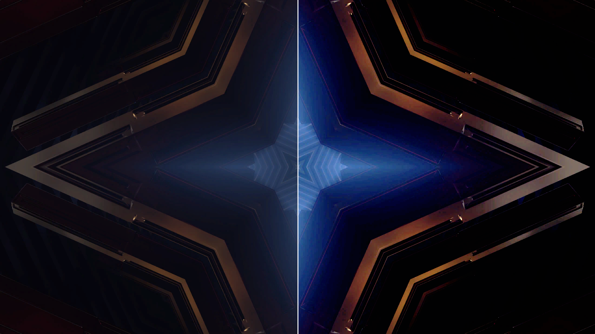

# valve

> **AI-assisted project.** This codebase was created with [Claude](https://claude.com/claude-code)
> (Anthropic), directed and reviewed by a human author. The valves are not
> drawn but solved, and the solution is measured: an offline harness drives
> the real plugin class in a headless GL context and reads each claim back
> out of the picture it made — the slope at the operating point is
> μR_L/(R_L + r_p) for all four preamp valves and the single-ended and
> push-pull formulas for all four power valves, to five figures; the slope
> drops by r_g/(r_g + R_s) where the grid starts to conduct, at the column
> where it should; one valve's H2/H1 is (f″/f′)·a/4; a matched pair makes no
> second harmonic (4e-8) and twice the mismatch makes twice the H2; a cold
> pair notches at the centre exactly as the model does; Y/C keeps hue to
> float precision while RGB turns it by half a radian; Composite's chroma
> gain follows f′(Y) up a modulated staircase. Eight negative controls and
> six one-character mutants prove the checks can fail. It has **never been
> loaded into Resolume on macOS**; on Windows it passed all nine of the fleet
> Arena gate's checks. On macOS it is loaded by [oxbow](https://github.com/stoatworks-labs/oxbow),
> which is a real FFGL host and is not Resolume. See [Status](#status).

The picture through a valve amplifier — run it like a guitar through an
overdriven amp — as an FFGL effect for [Resolume](https://resolume.com) Arena
and Avenue.



<sub>One frame of Resolume's bundled clip *IntoTheGlow_02*, rendered by `vatest`,
the offline harness — not captured from Resolume. Left: the clip. Right: the
defaults — two 12AX7 stages into a push-pull pair of EL34s, 1.2 V of drive,
resting at 0.3.</sub>

## The one idea

A valve's transfer curve is not something anybody draws. It is the valve's
plate-current law meeting the circuit's load line. Put the video level on
the grid of a real stage — a valve, a plate resistor, a supply, the next
grid's leak — and solve for the plate voltage. Chain the stages the way a
guitar amplifier does: preamp triodes, the loss of a tone stack between
them, a phase inverter, a power pair into an output transformer.

The valves are Norman Koren's SPICE models (1996), with his parameters:
the **12AX7, 12AT7, 12AU7 and 6DJ8** for the preamp; the **EL34, 6L6GC, KT88**
and the **300B** for the power stage.

## What falls out

None of these is drawn:

- **Gain is the operating point's.** A 12AX7 stage has a gain of 59 and
  clips at a volt; a 12AU7 in the same socket has 13 and stays clean. That is
  the swap guitarists make, and it works here for the same reason.
- **The two sides clip differently.** Toward cutoff the current fades
  softly. Past 0 V the grid conducts, loads whatever is driving it, and the
  stage's slope drops by r_g/(r_g + R_s) — 35 times — at a knee.
- **Every stage inverts,** so the asymmetry alternates down a chain, which
  is why two stages sound (look) different from one. As Wired shows the
  inversions: one stage is a negative.
- **One valve makes even harmonics; a pair cancels them.** A single-ended
  stage's distortion is mostly second harmonic. A push-pull pair is odd about
  its rest, so the second harmonic vanishes and the third stays; mismatch the
  pair and it comes back, in proportion.
- **Bias a pair cold and you get crossover.** At 5 % idle both valves are
  nearly off at rest: the centre of the curve has a third of the slope of
  its neighbours, a flat step at mid-grey. Bias hotter and it fills in.
- **Y/C keeps the hue.** Chroma travels as a subcarrier. Through any valve,
  its amplitude compresses — colour saturates, then limits — but its phase,
  which is the hue, cannot move. Put RGB through the same valves and every
  channel clips separately, so hues swing toward the primaries.
- **Composite is differential gain.** Luma and the subcarrier share one
  valve, so the colour's gain is the curve's slope at the brightness it rides
  on, and the curvature rectifies part of a strong colour into its own luma.


<sub>Six settings on the harness's card, with Show Curve on: the white curve is
the picture's transfer, the magenta one (Y/C) the chroma's amplitude, and in
RGB a mismatch draws three. Rendered by `vatest`; the labels were added
afterwards.</sub>

[](https://www.youtube.com/watch?v=DM2kHbvMlJw)

*[Watch it](https://www.youtube.com/watch?v=DM2kHbvMlJw) — 58 seconds:
Drive from clean to fuzz, the 12AX7-for-12AU7 swap, one preamp stage to four,
Bias from cold to hot, a push-pull pair biased into crossover, RGB against Y/C on
the same skulls, Mismatch splitting the curve in three, and Rest Level rescuing a
dark clip — with Show Curve drawing the transfer in the corner throughout. Every
frame is the real plugin's output: an FFGL plugin has no window, so the footage is
rendered by this repository's own offline harness (`vatest --pipe`, driven by a cue
sheet) rather than filmed off a screen, and the clips are Resolume's bundled demo
media.*

## Controls

| Group | |
| --- | --- |
| **Signal** | Signal (RGB / Y/C / Composite), Rest Level (the picture level that sits at the valves' rest — where a black-level clamp would hold it; 0.3 by default, lower for dark footage), Interstage (−40 to 0 dB between preamp stages: the tone stack's loss), Mismatch (0–25 % spread between valves: R, G and B become three valve sets, and each pair's halves differ) |
| **Luma / RGB** | Stages (0–4 preamp triodes), Preamp (12AX7, 12AT7, 12AU7, 6DJ8), Drive (volts on the first grid for black to white, 10 mV to 316 V), Bias (the preamp's rest from cutoff to 0 V), Power Stage (Off, Single-ended, Push-pull), Power Valve (EL34, 6L6GC, KT88, 300B), Master (the phase inverter and master pot: volts on the power grids per volt of preamp swing, 0.01 to 100), Power Bias (idle dissipation, 5 % to 100 % of the valve's rating; 70 % is where a tech sets it) |
| **Chroma** | The same eight, for the chroma's own amplifier in Y/C |
| **Output** | Output (Fit: black stays black and white stays white; Unity: the operating point's small-signal gain is 1, so drive compresses; Plate: the plate's own volts over its supply), Polarity (Corrected / As Wired), Show Curve, Mix |

Start with **Drive**, then **Stages** and **Preamp**. Turn **Rest Level** down
when a clip is dark and everything goes to black; that is the shadows
sitting in the valve's cutoff.

## Status

**v0.1.0, and honestly early — 4 October 2026.**

### Measured offline, on macOS

`tools/verify.sh` passes on this machine (M4 Max, macOS 26.4.1) against a fresh
universal Release build, running every rendered check at **two rasters**,
320×180 and 1280×720, and again on **Apple's software renderer** at 320×180.
Numbers below are at 1280×720.

| check | result |
| --- | --- |
| `--gain` | the picture's slope at mid-grey in Plate mode against small-signal theory from Koren's own partial derivatives: 12AX7 −58.900 (theory −58.901), 12AT7 −39.845 (−39.847), 12AU7 −13.0542 (−13.0542), 6DJ8 −23.015 (−23.015); EL34 single-ended −57.776 (−57.776), push-pull 8.7404 (8.7405); 6L6GC, KT88 and 300B the same to four or five figures |
| `--knee` | across the grid-current knee the slope drops to 0.02852 of itself (12AX7) and 0.02847 (12AU7) against r_g/(r_g + R_s) = 0.02857; the sharpest bend in the ramp is at the column where the grid crosses 0 V |
| `--harmonics` | one 12AX7: H2/H1 0.01702 against Taylor's 0.01697, H3/H1 0.000517 against 0.000514; an EL34 pair: H2/H1 4e-8 matched (the float's floor is 6e-6) with H3/H1 0.031; 2 % mismatch gives H2/H1 0.00113, 4 % gives 0.00227 (×2.002) |
| `--crossover` | at five idle settings the centre slope is the composite load line's (worst 0.03 of tolerance); the notch's depth — centre slope over its neighbours' — is the model's, 0.336 at 5 % idle rising to 0.896 at 100 % |
| `--hue` | Y/C: 96 patches, hue kept to the float's bound; the chroma's amplitude is the describing function (4096-point quadrature of the model) within 0.62 of tolerance, and falls as amplitude rises; RGB through the same valve turns hue by up to 0.58 rad |
| `--dg` | Composite: the chroma's gain up a seven-step modulated staircase is f′(Y)/f′(0.5) (worst 0.01 of tolerance), a differential gain of 48 %; a 0.2 carrier lifts its luma by +0.00911 against f″a²/4 = +0.00905; in Y/C the gain does not move with luma (6.6e-6) |
| `--polarity` | as wired, ten chains have the sign their inversions give; corrected, all rise; an inverting chroma chain turns every hue by π to 3e-7 rad |
| `--identity` | no valves is a wire in all three modes (worst 6e-7); 10 mV on a 12AU7 in Unity is the input to 1.7e-4, inside the curve's own departure; Mix 0 is the input bit for bit; premultiplied alpha is kept |
| `--reference` | every pixel of six settings against the CPU running the plugin's own tables through the shader's arithmetic, worst 0.16 of a bound walked lookup by lookup; and the tables against the harness's own valves (its own Koren, operating points and solves), worst 0.77 of the interpolation bound |
| `--curve` | Show Curve draws exactly the curve the picture follows (0 px) and changes nothing outside its box |
| `--model` | the eight valves are Koren's `Tube.lib` parameter for parameter; his law restated agrees to rounding; every operating point, load line and bias against the harness's own bisection solves; each table's rest is its centre node and reads exactly 0, its grid-current knee is on a node, and it reaches a kilovolt each way |
| `--negative` | eight negative controls from six perturbed models — no grid current (against `--knee` and `--reference`), an undriven half, each half on its own load line, chroma as baseband U and V, the subcarrier round the valve, a 12AX7 with μ = 10 (against `--gain` and `--model`) — each **fails** its check, on the physics: without grid current the knee's ratio reads 1.00, not 0.029 |
| mutation | six one-character mutants of the shipped GLSL and C++ (`tools/mutate.sh`), each caught |
| `tools/sweep.py` | all **24** controls measurably change the picture |
| the bundle | universal (`x86_64 arm64`), exports `plugMain`, ad-hoc signs; `oxbow` reports `SW Valve` / `VA01` / `effect` and renders 120 frames through `plugMain` |

Render cost, GPU timer queries, median of 60 frames, on a GPU shared with
other builds (the figures move by up to 2× between runs): **0.1–0.2 ms** at
720p and 1080p, **0.55 ms** at 4K for the defaults; Y/C and Composite add a
small describing-function pass, **0.9 ms** at 4K at most. Solving the tables
again when a valve, bias or mismatch setting moves costs about **10 ms** on the
CPU for a whole chain (only the stages a setting touches are re-solved);
Drive, Master, Interstage, Stages and Rest Level cost nothing. macOS figures
only.

### Not established

It has **never been loaded into Resolume on macOS**. Everything above was
compiled, rendered and measured offline against the real plugin class in a
headless CGL context, plus an `oxbow` load. On Windows, a build of this source
passed all 9 of the fleet Arena gate's checks on win-lab (Resolume Arena 7.27.1,
Mesa llvmpipe, no GPU, 2026-10-04): it loads from Extra Effects, registers as
`SW Valve` / `VA01` / effect, all 30 host controls match the declaration (the two
names at exactly 16 characters arrive whole), it renders, every control (and Resolume's own
Opacity: 25) moves the picture, and Arena's log stays clean. Software rendering says
nothing about a GPU or about speed. How it looks on real footage at a show, how
the controls read in Arena's inspector on macOS, and whether a 10 ms table solve
is noticed while dragging Bias are untested. Koren's models are fits to published curves, good to a few per
cent; the circuit values are typical guitar-amplifier ones, not any one
amplifier's. The model is memoryless: the coupling capacitors' blocking, the
Miller capacitance that would smear a 12AX7's output horizontally (and take a
4.43 MHz chroma carrier out entirely), supply sag and the output transformer
are not in it. There is a [user guide](https://stoatworks-labs.com/software/valve/guide/).
No OpenFX port and no browser demo, not in scope for 0.1.0.

## Build

Needs CMake 3.15+, a C++17 compiler, and the FFGL SDK submodule.

```bash
git clone --recursive https://github.com/stoatworks-labs/valve
cd valve
cmake -B build -DCMAKE_BUILD_TYPE=Release
cmake --build build --parallel
cmake --install build     # into ~/Documents/Resolume Arena/Extra Effects
```

macOS builds are universal (Apple Silicon + Intel) by default; add
`-DCMAKE_OSX_ARCHITECTURES=arm64` for a faster dev build. Windows needs GLEW via vcpkg.

## Building and testing

The offline harness renders the real plugin class headlessly:

```bash
./build/vatest --out /tmp/frame.png --size 1920x1080   # the test card
./build/vatest --list                                  # every control, kind and default
./build/vatest --gain --knee --harmonics --crossover   # each claim, measured
./build/vatest --hue --dg --polarity --identity --reference --curve
./build/vatest --negative                              # and the checks can fail
./build/vatest --offline                               # what needs no GL (CI)
./build/vatest --bench                                 # 720p, 1080p and 4K
python3 tools/sweep.py                                 # no control is silently dead
tools/mutate.sh                                        # one character at a time
tools/verify.sh                                        # all of it, on a fresh universal build
```

## License

MIT. See [LICENSE](LICENSE) and [ATTRIBUTIONS.md](ATTRIBUTIONS.md).

<!-- attributions:start -->
This project is built on other people's work — see [ATTRIBUTIONS.md](ATTRIBUTIONS.md).
<!-- attributions:end -->
